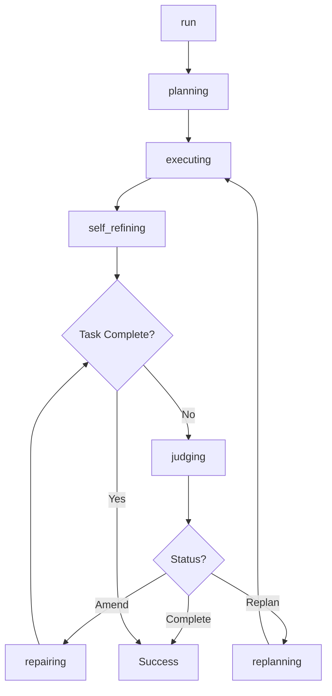

## Overview

The `FridayAgent` class is the core orchestration agent that integrates planning, retrieval, and execution strategies to process tasks. It manages errors, refines strategies, and ensures successful task completion through dynamic planning, information retrieval, and self-refinement mechanisms.

## Class Definition

```python
from oscopilot.agents.friday_agent import FridayAgent
```

## Constructor

### `__init__(planner, retriever, executor, Tool_Manager, config)`

Initializes the FridayAgent with specified planning, retrieving, and executing strategies, alongside configuration settings.

<ParamField path="planner" type="callable" required>
  A strategy for planning the execution of tasks
</ParamField>

<ParamField path="retriever" type="callable" required>
  A strategy for retrieving necessary information or tools related to the tasks
</ParamField>

<ParamField path="executor" type="callable" required>
  A strategy for executing planned tasks
</ParamField>

<ParamField path="Tool_Manager" type="callable" required>
  A tool manager for handling tool-related operations
</ParamField>

<ParamField path="config" type="object" required>
  Configuration settings for the agent
</ParamField>

**Raises:**
- `ValueError`: If the OS version check fails

**Example:**

```python
from oscopilot import FridayAgent, ToolManager
from oscopilot import FridayPlanner, FridayRetriever, FridayExecutor
from oscopilot.utils import setup_config

config = setup_config()
agent = FridayAgent(
    planner=FridayPlanner,
    retriever=FridayRetriever,
    executor=FridayExecutor,
    Tool_Manager=ToolManager,
    config=config
)
```

## Methods

### `run(task)`

Executes the given task by planning, executing, and refining as needed until the task is completed or fails.

<ParamField path="task" type="object" required>
  The high-level task to be executed
</ParamField>

<ResponseField name="return" type="None">
  No explicit return value. The method controls the flow of task execution and may exit the process in case of irreparable failures.
</ResponseField>

**Example:**

```python
agent = FridayAgent(planner, retriever, executor, Tool_Manager, config)
task = "Create a report from the data in file.csv"
agent.run(task)
```

**Process:**
1. Resets the planner and inner monologue
2. Plans the task into sub-tasks
3. Executes each sub-task sequentially
4. Refines execution if needed
5. Handles exceptions during execution

### `planning(task)`

Decomposes a given high-level task into a list of sub-tasks by retrieving relevant tool names and descriptions.

<ParamField path="task" type="object" required>
  The high-level task to be planned and executed
</ParamField>

<ResponseField name="return" type="list">
  A list of sub-tasks generated by decomposing the high-level task, intended for sequential execution
</ResponseField>

**Example:**

```python
task = "Analyze sales data and create visualizations"
sub_tasks = agent.planning(task)
# Returns: ['load_data', 'clean_data', 'analyze_data', 'create_visualization']
```

### `executing(tool_name, original_task)`

Executes a given sub-task as part of the task execution process, handling different types of tasks including code execution, API calls, and question-answering.

<ParamField path="tool_name" type="str" required>
  The name of the tool associated with the sub-task
</ParamField>

<ParamField path="original_task" type="object" required>
  The original high-level task that has been decomposed into sub-tasks
</ParamField>

<ResponseField name="return" type="ExecutionState">
  The state of execution for the sub-task, including the result, any errors encountered, and execution-related information
</ResponseField>

**Supported Node Types:**
- `Python`: Executes Python code
- `Shell`: Executes shell commands
- `AppleScript`: Executes AppleScript commands
- `API`: Makes API calls
- `QA`: Performs question-answering

### `self_refining(tool_name, execution_state)`

Analyzes and potentially refines the execution of a tool based on its current execution state. This can involve replanning or repairing the execution strategy.

<ParamField path="tool_name" type="str" required>
  The name of the tool being executed
</ParamField>

<ParamField path="execution_state" type="ExecutionState" required>
  The current state of the tool's execution, encapsulating all relevant execution information including errors, results, and codes
</ParamField>

<ResponseField name="return" type="tuple">
  A tuple containing:
  - `isTaskCompleted` (bool): Indicates whether the task has been successfully completed
  - `isReplan` (bool): Indicates whether a replan is required due to execution state analysis
</ResponseField>

**Example:**

```python
execution_state = agent.executing('data_loader', task)
is_completed, is_replan = agent.self_refining('data_loader', execution_state)
```

### `judging(tool_name, state, code, description)`

Evaluates the execution of a tool based on its execution state and provided code, determining whether the tool's execution was successful or requires amendment.

<ParamField path="tool_name" type="str" required>
  The name of the tool being judged
</ParamField>

<ParamField path="state" type="ExecutionState" required>
  The current execution state of the tool, including results and error information
</ParamField>

<ParamField path="code" type="str" required>
  The source code associated with the tool's execution
</ParamField>

<ParamField path="description" type="str" required>
  A description of the tool's intended functionality
</ParamField>

<ResponseField name="return" type="JudgementResult">
  An object encapsulating the judgement on the tool's execution, including:
  - `status`: Whether it needs repair ('Amend', 'Complete', or 'Replan')
  - `critique`: Feedback on the execution
  - `score`: Execution quality score
</ResponseField>

### `repairing(tool_name, code, description, state, critique, status)`

Attempts to repair the execution of a tool by amending its code based on the critique received and the current execution state.

<ParamField path="tool_name" type="str" required>
  The name of the tool being repaired
</ParamField>

<ParamField path="code" type="str" required>
  The current code of the tool that requires repairs
</ParamField>

<ParamField path="description" type="str" required>
  A description of the tool's intended functionality
</ParamField>

<ParamField path="state" type="ExecutionState" required>
  The current execution state of the tool, including results and error information
</ParamField>

<ParamField path="critique" type="str" required>
  Feedback on the tool's last execution attempt, identifying issues to be addressed
</ParamField>

<ParamField path="status" type="str" required>
  Three status types: 'Amend', 'Complete', and 'Replan'
</ParamField>

<ResponseField name="return" type="RepairingResult">
  An object encapsulating the result of the repair attempt, including:
  - `status`: Whether the task has been completed successfully
  - `code`: The amended code
  - `critique`: Updated feedback
  - `score`: Execution quality score
  - `result`: The execution result
</ResponseField>

**Process:**
1. Iterates up to `max_repair_iterations` times
2. Amends code based on critique
3. Re-executes the amended code
4. Re-judges the execution
5. Stores successful tools in the repository

## Execution Flow



## Attributes

- `config`: Configuration settings for the agent
- `planner`: The planning strategy instance
- `retriever`: The retrieval strategy instance
- `executor`: The execution strategy instance
- `score`: Minimum score threshold for tool storage
- `task_status`: Current status of task execution
- `inner_monologue`: Internal state tracking
- `system_version`: Operating system version

## Related Classes

- [BaseAgent](/api/agents/base-agent): The base class for all agents
- [SelfLearning](/api/agents/self-learning): Self-learning functionality for agents