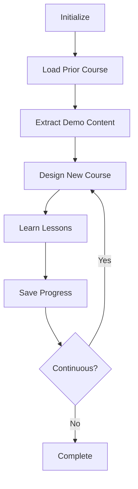

## Overview

The `SelfLearning` class facilitates autonomous learning for software-related topics by automatically generating and engaging with courses based on provided software and package information. It enables agents to continuously improve their knowledge and capabilities.

## Class Definition

```python
from oscopilot.agents.self_learning import SelfLearning
```

## Constructor

### `__init__(agent, learner, tool_manager, config, text_extractor=None)`

Initializes the SelfLearning class with necessary components for course generation and learning.

<ParamField path="agent" type="object" required>
  The executing agent that will run or simulate the course
</ParamField>

<ParamField path="learner" type="object" required>
  A learning module or tool responsible for course creation
</ParamField>

<ParamField path="tool_manager" type="object" required>
  Manages and orchestrates the use of external tools necessary for course operations
</ParamField>

<ParamField path="config" type="dict" required>
  Configuration parameters that guide the self-learning process
</ParamField>

<ParamField path="text_extractor" type="callable" optional>
  A function or callable that extracts text from provided file paths
</ParamField>

**Example:**

```python
from oscopilot.agents.self_learning import SelfLearning
from oscopilot.agents.friday_agent import FridayAgent

agent = FridayAgent(planner, retriever, executor, Tool_Manager, config)
learning = SelfLearning(
    agent=agent,
    learner=Learner,
    tool_manager=tool_manager,
    config=config,
    text_extractor=TextExtractor
)
```

## Attributes

<ParamField path="config" type="dict">
  Configuration settings for the learning process
</ParamField>

<ParamField path="agent" type="object">
  An external agent that interacts with the learning content or environment
</ParamField>

<ParamField path="learner" type="object">
  A learner object responsible for designing the course
</ParamField>

<ParamField path="tool_manager" type="object">
  Manages the tools required for course creation and learning
</ParamField>

<ParamField path="text_extractor" type="object">
  Component responsible for extracting text from files (optional)
</ParamField>

<ParamField path="course" type="dict">
  A dictionary to store course details
</ParamField>

## Methods

### `self_learning(software_name, package_name, demo_file_path)`

Initiates the self-learning process by designing a course and triggering the learning mechanism.

<ParamField path="software_name" type="str" required>
  The name of the software for which the course is being designed
</ParamField>

<ParamField path="package_name" type="str" required>
  The name of the software package related to the course
</ParamField>

<ParamField path="demo_file_path" type="str" required>
  The file path of a demo or example file that is relevant to the course content
</ParamField>

<ResponseField name="return" type="None">
  No return value. The method updates internal state and saves the course to disk.
</ResponseField>

**Example:**

```python
learning = SelfLearning(agent, learner, tool_manager, config)
learning.self_learning(
    software_name="pandas",
    package_name="dataframe",
    demo_file_path="examples/data_analysis.py"
)
```

**Process:**
1. Loads or creates a course file at `courses/{software_name}_{package_name}.json`
2. Extracts content from demo file if provided
3. Retrieves the last 50 completed lessons (if any)
4. Designs a new course based on prior learning
5. Executes the course lessons
6. Saves the updated course to disk

### `continuous_learning(software_name, package_name, demo_file_path=None)`

Implements a continuous learning process that updates and applies new courses based on a designed curriculum.

<ParamField path="software_name" type="str" required>
  Name of the software being learned
</ParamField>

<ParamField path="package_name" type="str" required>
  Name of the package within the software
</ParamField>

<ParamField path="demo_file_path" type="str" optional>
  Path to a demo file used for extracting text content
</ParamField>

<ResponseField name="return" type="None">
  Runs indefinitely, continuously updating and learning new courses
</ResponseField>

**Example:**

```python
# Warning: This runs indefinitely
learning.continuous_learning(
    software_name="numpy",
    package_name="arrays",
    demo_file_path="examples/array_ops.py"
)
```

**Process:**
1. Initializes learning environment
2. Enters infinite loop:
   - Loads last 50 lessons from course
   - Designs new course based on prior learning
   - Updates the course dictionary
   - Learns the new lessons
   - Saves progress to disk

### `course_design(software_name, package_name, demo_file_path, file_content=None)`

Designs a course based on the provided software and package name, using content extracted from a demo file.

<ParamField path="software_name" type="str" required>
  The name of the software for which the course is designed
</ParamField>

<ParamField path="package_name" type="str" required>
  The package name related to the software
</ParamField>

<ParamField path="demo_file_path" type="str" required>
  Path to the demo file used as content for the course
</ParamField>

<ParamField path="file_content" type="str" optional>
  Content of the demo file to be included in the course
</ParamField>

<ResponseField name="return" type="dict">
  The designed course as a dictionary
</ResponseField>

**Example:**

```python
course = learning.course_design(
    software_name="matplotlib",
    package_name="plotting",
    demo_file_path="examples/plot_demo.py",
    file_content=extracted_content
)
# Returns: {'lesson_1': 'Create basic plot', 'lesson_2': 'Add labels', ...}
```

### `learn_course(course)`

Triggers the learning of the designed course using the configured agent.

<ParamField path="course" type="dict" required>
  The course dictionary containing lesson details to be learned
</ParamField>

<ResponseField name="return" type="None">
  No return value. Executes each lesson in the course.
</ResponseField>

**Example:**

```python
course = {
    'lesson_1': 'Load data with pandas',
    'lesson_2': 'Clean missing values',
    'lesson_3': 'Create visualization'
}
learning.learn_course(course)
```

**Process:**
- Logs the number of lessons in the course
- Iterates through each lesson
- Logs lesson name and content
- Executes lesson using `self.agent.run(lesson)`

### `text_extract(demo_file_path)`

Extracts text from the specified demo file path using the configured text extractor.

<ParamField path="demo_file_path" type="str" required>
  The path to the demo file from which content needs to be extracted
</ParamField>

<ResponseField name="return" type="str">
  The extracted content from the file
</ResponseField>

**Example:**

```python
content = learning.text_extract("examples/advanced_usage.py")
# Returns: "import pandas as pd\n\ndf = pd.read_csv(...)\n..."
```

## Course Storage

Courses are stored as JSON files in the `courses/` directory:

```
courses/
├── pandas_dataframe.json
├── numpy_arrays.json
└── matplotlib_plotting.json
```

**Course File Format:**

```json
{
    "lesson_1": "Task description for lesson 1",
    "lesson_2": "Task description for lesson 2",
    "lesson_3": "Task description for lesson 3"
}
```

## Usage Patterns

### Single Learning Session

```python
from oscopilot.agents.self_learning import SelfLearning
from oscopilot.agents.friday_agent import FridayAgent

# Initialize components
agent = FridayAgent(planner, retriever, executor, Tool_Manager, config)
learning = SelfLearning(agent, learner, tool_manager, config)

# Run single learning session
learning.self_learning(
    software_name="scikit-learn",
    package_name="classification",
    demo_file_path="examples/classifier_demo.py"
)
```

### Continuous Learning Loop

```python
# Start continuous learning (runs indefinitely)
learning.continuous_learning(
    software_name="tensorflow",
    package_name="neural_networks",
    demo_file_path="examples/nn_demo.py"
)
```

### Custom Course Design

```python
# Extract content first
content = learning.text_extract("path/to/demo.py")

# Design custom course
course = learning.course_design(
    software_name="custom_lib",
    package_name="custom_module",
    demo_file_path="path/to/demo.py",
    file_content=content
)

# Review course before learning
print(f"Course has {len(course)} lessons")
for name, lesson in course.items():
    print(f"{name}: {lesson}")

# Execute the course
learning.learn_course(course)
```

## Learning Strategy

The self-learning system follows this strategy:

1. **Prior Knowledge**: Loads previously completed lessons (last 50)
2. **Context Extraction**: Extracts relevant context from demo files
3. **Course Generation**: Creates new lessons building on prior knowledge
4. **Execution**: Runs each lesson through the agent
5. **Persistence**: Saves learned lessons for future reference
6. **Iteration**: Continuously builds knowledge over time

## Course Progression



## Best Practices

1. **Start Simple**: Begin with basic demo files and gradually increase complexity
2. **Provide Context**: Include relevant demo files to guide course generation
3. **Monitor Progress**: Check generated course files to understand learning trajectory
4. **Limit Scope**: Focus on specific packages rather than entire libraries
5. **Use Text Extractors**: Implement text extractors for rich demo file content

## Related Classes

- [FridayAgent](/api/agents/friday-agent): The agent that executes learning tasks
- [BaseAgent](/api/agents/base-agent): The base class for all agents