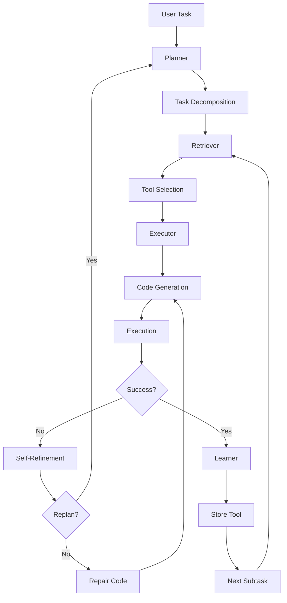

## Overview

OS-Copilot is built on a sophisticated multi-agent architecture that enables autonomous task execution through planning, retrieval, execution, and self-learning. The framework orchestrates these components to break down complex user requests into executable subtasks.

## Core Architecture

<CardGroup cols={2}>
  <Card title="Planner" icon="sitemap">
    Decomposes complex tasks into manageable subtasks with dependency tracking
  </Card>
  <Card title="Retriever" icon="magnifying-glass">
    Selects relevant tools from the repository using vector-based similarity search
  </Card>
  <Card title="Executor" icon="play">
    Generates and executes code to complete subtasks across multiple environments
  </Card>
  <Card title="Learner" icon="graduation-cap">
    Stores successful tools for reuse and continuous improvement
  </Card>
</CardGroup>

## System Flow

The OS-Copilot framework follows a structured execution pipeline:



## Component Interactions

### 1. Planning Phase

The **Planner** receives a high-level task and:

- Retrieves relevant tool descriptions from the Tool Manager
- Decomposes the task into subtasks using LLM-based reasoning
- Creates a directed acyclic graph (DAG) of task dependencies
- Performs topological sorting to determine execution order

<Accordion title="Example: Task Decomposition">
```python
# From friday_planner.py:35-74
def decompose_task(self, task, tool_description_pair):
    """
    Decomposes a complex task into manageable subtasks and updates the tool graph.
    """
    files_and_folders = self.environment.list_working_dir()
    tool_description_pair = json.dumps(tool_description_pair)
    api_list = get_open_api_description_pair()
    
    sys_prompt = self.prompt['_SYSTEM_TASK_DECOMPOSE_PROMPT']
    user_prompt = self.prompt['_USER_TASK_DECOMPOSE_PROMPT'].format(
        system_version=self.system_version,
        task=task,
        tool_list=tool_description_pair,
        api_list=api_list,
        working_dir=self.environment.working_dir,
        files_and_folders=files_and_folders
    )
    
    response = send_chat_prompts(sys_prompt, user_prompt, self.llm)
    decompose_json = self.extract_json_from_string(response)
    
    # Build tool graph and topologically order tools
    if decompose_json != 'No JSON data found in the string.':
        self.create_tool_graph(decompose_json)
        self.topological_sort()
```
</Accordion>

### 2. Retrieval Phase

The **Retriever** enhances each subtask by:

- Performing vector similarity search in the tool repository
- Retrieving top-k most relevant tools and their code
- Filtering tools based on task-specific requirements
- Providing context for code generation

### 3. Execution Phase

The **Executor** generates and runs code:

- Generates Python, Shell, or AppleScript code based on task type
- Executes code in isolated environments (Jupyter, Bash, AppleScript)
- Captures execution results and errors
- Judges whether the task was completed successfully

### 4. Self-Refinement Loop

When execution fails or produces incorrect results:

<Steps>
  <Step title="Judge">
    Evaluates execution results against task requirements
  </Step>
  <Step title="Analyze">
    Determines if error is amendable or requires replanning
  </Step>
  <Step title="Repair or Replan">
    Either fixes the code or creates new subtasks
  </Step>
  <Step title="Re-execute">
    Runs the amended code or new task plan
  </Step>
</Steps>

<Note>
The self-refinement loop has a configurable maximum iteration limit (`max_repair_iterations`) to prevent infinite loops.
</Note>

## Tool Management System

The framework maintains a dynamic tool repository:

- **Vector Database**: Chroma DB with OpenAI embeddings for semantic search
- **Tool Storage**: JSON metadata + individual Python files for each tool
- **Automatic Indexing**: Successful tools are automatically added to the repository
- **Quality Threshold**: Only tools scoring above a threshold are stored

```python
# From friday_agent.py:119-121
if node_type == 'Python' and isTaskCompleted and score >= self.score:
    self.executor.store_tool(tool_name, code)
    print(f"{tool_name} has been stored in the tool repository.")
```

## Environment Abstraction

OS-Copilot supports multiple execution environments:

<CardGroup cols={3}>
  <Card title="Python/Jupyter" icon="python">
    IPython kernel for Python code execution
  </Card>
  <Card title="Bash" icon="terminal">
    Shell commands on Linux/macOS
  </Card>
  <Card title="AppleScript" icon="apple">
    macOS automation scripts
  </Card>
</CardGroup>

All environments inherit from `BaseEnv` and provide:
- Working directory management
- Code execution with timeout handling
- State tracking (result, error, pwd, ls)
- Clean termination and reset

## Agent Orchestration

The `FridayAgent` class orchestrates the entire pipeline:

```python
# From friday_agent.py:45-72
def run(self, task):
    self.planner.reset_plan()
    self.reset_inner_monologue()
    sub_tasks_list = self.planning(task)
    print(f"The task list obtained after planning is: {sub_tasks_list}")

    while self.planner.sub_task_list:
        try:
            sub_task = self.planner.sub_task_list.pop(0)
            execution_state = self.executing(sub_task, task)
            isTaskCompleted, isReplan = self.self_refining(sub_task, execution_state)
            if isReplan: continue
            if isTaskCompleted:
                print("The execution of the current sub task has been successfully completed.")
            else:
                print(f"{sub_task} not completed in repair round {self.config.max_repair_iterations}")
                break
        except Exception as e:
            print(f"Current task execution failed. Error: {str(e)}")
            break
```

## Key Design Principles

<AccordionGroup>
  <Accordion title="Modularity">
    Each component (Planner, Retriever, Executor, Learner) is independently replaceable and testable.
  </Accordion>
  
  <Accordion title="Extensibility">
    New execution environments and tool types can be added by inheriting from base classes.
  </Accordion>
  
  <Accordion title="Fault Tolerance">
    Multiple retry mechanisms and fallback strategies ensure robust operation.
  </Accordion>
  
  <Accordion title="Self-Improvement">
    Successful executions contribute to the tool repository, improving future performance.
  </Accordion>
</AccordionGroup>

## Next Steps

<CardGroup cols={2}>
  <Card title="Agents" icon="robot" href="/concepts/agents">
    Learn about the BaseAgent and FridayAgent classes
  </Card>
  <Card title="Modules" icon="puzzle-piece" href="/concepts/modules">
    Explore Planner, Retriever, Executor, and Learner modules
  </Card>
</CardGroup>
